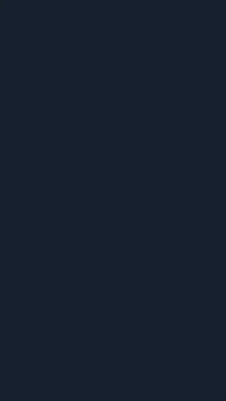

# Meu [Portfólio](https://caioosantos.github.io/portfolio/)  

Bem-vindo ao meu portfólio pessoal! Você encontrará alguns exemplos de projetos e habilidades.

##

### Tela Web
<div align="center">
  
</div>

##

### Tela Mobile
<div align="center">
  
  
</div>

## 

### Tecnologias Utilizadas

<div style="display: inline_block"><br>
  
  
  
</div>

##

### Funcionalidades

- Apresentação de projetos
- Blog pessoal
- Seção de contato

##

### Instalação

Siga os passos abaixo para instalar o projeto localmente.

1. Clone o repositório:
    ```bash
    git clone https://github.com/caioosantos/portfolio.git
    ```
2. Entre no diretório do projeto:
    ```bash
    cd portfolio
    ```
3. Instale as dependências:
    ```bash
    npm install
    ```

##

### Como utilizar

Inicie o servidor:
    ```
    npm start
    ```
    
<h4>Abra o navegador e acesse 'http://localhost:3000'.</h4>

##

### Estrutura do Projeto

```plaintext
portfolio/
├── assets/
│   ├── img/
│   ├── js/
│   ├── styles/
├── index.html
└── README.md
```

##

### Autores

### Caio Santos - [GitHub](https://github.com/caioosantos)

## 

### Entre em contato comigo através de:

#### Email: caiohbsantos_@outlook.com
<a href="https://www.linkedin.com/in/caioh-santos/" target="_blank"></a> 
<a href="https://www.instagram.com/caaiiio_/" target="_blank"></a>


